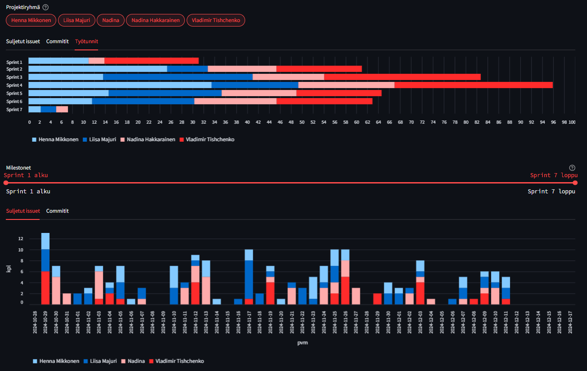

# RepoRouskun käyttöohjeet

RepoRousku on kehitetty tukemaan projektitiimien toimintaa GitLabin ja Clockifyn avulla. Sen avulla käyttäjät voivat tarkastella projektidataa, kuten issueita, committeja ja työaikakirjauksia, ja luoda visuaalisia raportteja suoraan selaimessa. Tämä ohje auttaa sinua RepoRouskun käytössä. 

## Asennus ja käyttöönotto
1. **Vaaditut työkalut:**
    * **Docker**: RepoRousku toimii Docker-kontissa, joten varmista, että Docker on asennettuna tietokoneellesi. 
    * **GitLab** ja **Clockify**-tunnukset: Tarvitset pääsyn GitLab-projektiin ja mahdollisesti Clockify-tilin, jos haluat hyödyntää tuntidataa. 

2. **Asennusohjeet:**
    * Kloonaa RepoRouskun GitLab-repositorio: 
    ```python
    git clone git@gitlab.dclabra.fi:projektiopinnot-4-digitaaliset-palvelut/palikkapalvelut.git
    ```

    * **Rakenna Docker-kontti:**
    ```python
    docker-compose up --build
    ```
    * **Avaa selain ja siirry osoitteeseen:**
    http://localhost:8501

## Käyttöliittymän ohjeet

Kun käynnistät RepoRouskun ensimmäistä kertaa, sivu pyytää sinua syöttämään GitLab sekä Clockify Access tokenit. 

!!!Tip 
    **Miten löydän GitLab tai Clockify Access tokenin?** Kurkkaa [täältä](https://gitlab.dclabra.fi/wiki/MOpevPu-QrClH4_ouAV04A?view)


Tokenit kannattaa tallentaa **Tallenna tokenit** -napukalla, jos tarkoituksenasi on tarkastella myöhemmin esim. toisen projektin tietoja.

Jotta pääset etusivusta pidemmälle, on sinun annettava Rouskuttimelle **GitLab-repositorion osoite** sekä **GitLab Access Token**. Clockifytä koskevat valinnat ovat vaihtoehtoisia. 

Kun tarvittavat tiedot on lisätty, paina **Rouskuta** -painiketta. 

**Projekti**-sivu koostaa projektin metriikat yhteen interaktiiviseen näkymään.



Sivuston vasemmasta laidasta pääset navigoitumaan sivujen välillä. **Jäsenet** -sivu koostaa jäsenkohtaiset tiedot projekteista ja siihen käytetyistä tunneista sekä **Avaa GitLab**-painikkeella päääset kätevästi suoraan projektin GitLab-repositorioon. 


Jäsenet-sivusto voi olla hyödyllinen etenkin, jos sinun on tarpeen raportoida projektikurssin aikana suorittamasi issuet ja projektiin käytetty työaika. 


## Tuki ja ongelmanratkaisu

1. **Sovellus ei käynnisty?** 
    * Varmista, että Docker toimii oikein
    * Käytä komentoa docker-compose logs (tai ChatGPT:tä) ongelmien ratkaisemiseksi
2. **GitLab -yhteys ei toimi?** 
    * Varmista, että GitLab Access Token on oikein määritetlty
    * Varmista, että repon linkki on projektin "juuresta"
3. **Clockify-tiedot eivät näy?**
    * Varmista, että Clockify Access Token on oikein määritetty
    * Tarkista, että sinulla on tarvittavat oikeudet
