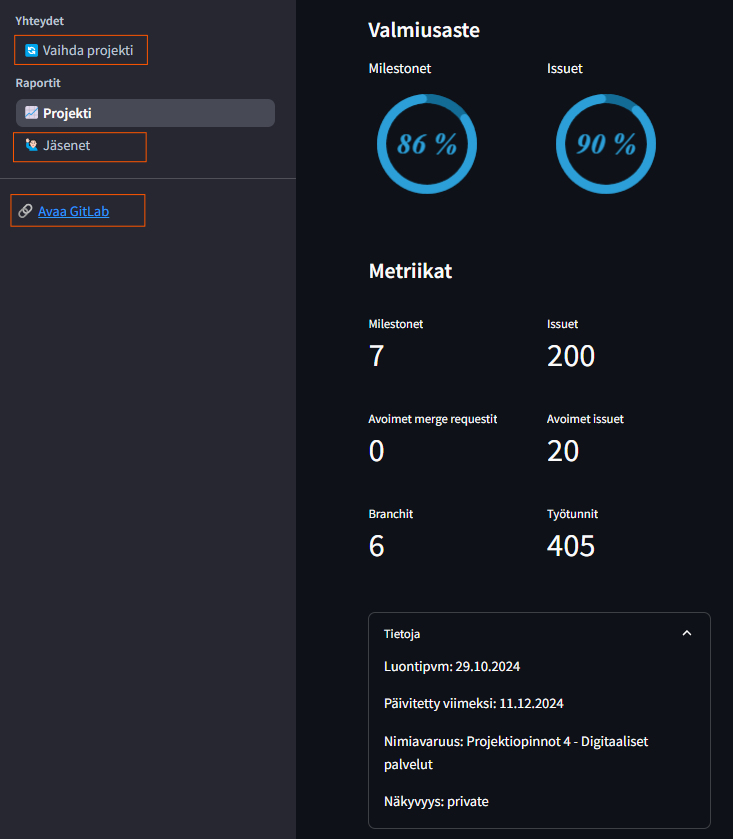

# RepoRouskun käyttöohjeet

RepoRousku on kehitetty tukemaan projektitiimien toimintaa GitLabin ja Clockifyn avulla. Sen avulla käyttäjät voivat tarkastella projektidataa, kuten issueita, committeja ja työaikakirjauksia, ja luoda visuaalisia raportteja suoraan selaimessa. Tämä ohje auttaa sinua RepoRouskun käytössä. 

## Asennus ja käyttöönotto

1. **Vaaditut työkalut (dev/paikallinen käyttö):**
    * **Docker**: RepoRousku toimii Docker-kontissa, joten varmista, että Docker on asennettuna tietokoneellesi. 
    * **GitLab** ja **Clockify**-tunnukset: Tarvitset pääsyn GitLab-projektiin ja mahdollisesti Clockify-tilin, jos haluat hyödyntää tuntidataa. 

2. **Asennusohjeet:**
    * Kloonaa RepoRouskun GitLab-repositorio: 
    ```python
    git clone git@gitlab.dclabra.fi:projektiopinnot-4-digitaaliset-palvelut/palikkapalvelut.git
    ```

    * **Rakenna ja käynnistä Docker-kontti:**
    ```python
    docker compose -f docker-compose.dev.yml up --build
    ```
    * **Avaa selain ja siirry osoitteeseen:**
    `http://localhost:8501`

## Käyttöliittymän ohjeet

Kun käynnistät RepoRouskun ensimmäistä kertaa, sivu pyytää sinua syöttämään GitLab sekä Clockify Access tokenit. 

!!!Tip 
    **Miten löydän GitLab tai Clockify Access tokenin?** Kurkkaa [täältä](#ohje-gitlab--ja-clockify-access-tokeneiden-luontiin)


Tokenit kannattaa tallentaa `Tallenna tokenit` -napukalla (huom. vain paikallinen käyttö), jos tarkoituksenasi on tarkastella myöhemmin esim. toisen projektin tietoja.

Jotta pääset etusivusta pidemmälle, on sinun annettava Rouskuttimelle **GitLab-repositorion osoite** sekä **GitLab Access Token**. Clockifytä koskevat valinnat ovat vaihtoehtoisia. 

Kun tarvittavat tiedot on lisätty, paina `Rouskuta` -painiketta.

### Projekti -sivusto

**Projekti**-sivu koostaa projektin metriikat yhteen interaktiiviseen näkymään.

Voit tarkastella projektin aikana kertyneiden suljettujen issueiden, committien tai tuntien jakautumista projektitiimin ja sprintien välille. 

Suljettujen issueiden ja kommittien jakautumista on mahdollista tarkastella myös päivätasolla. 


Projekti-sivun vasempaan reunaan on kerätty lisää tietoa projektin tilasta: 

- Päättyneet milestonet / suunnitellut milestonet
- Suljetut issuet / suunnitelltun issuet
- Suunniteltujen milestonien kokonaismäärä
- Issueiden kokonaismäärä (suunnitellut + suljetut)
- Avoimet merge requestit
- Avoimet issuet
- Branchit
- Projektin kokonaistunnit (jos clockify-data on haettu)
- Repositorion luontipäivä
- Edellinen muutos repositoriossa
- Nimiavaruus
- Projektin näkyvyys

Vasemman yläkulman nuolesta painamalla löydät navigaatiovalikon. _Vaihda projekti_ -painikkeella pääset etusivulle. _Jäsenet_ sivustolla tarkastellaan projektitiimin jäsenien statistiikkaa hieman tarkemmin ja _Avaa GitLab_ -painike vie sinut suoraan projektin GitLab-repositorioon. 




### Jäsenet -sivusto

Jäsenet-sivustoa kannattaa hyödyntää, jos sinun tai tiimisi tulee raportoida projektikurssin aikana suoritetut issuet ja projektiin käytetty työaika työaikakirjauksissa hyödynnettyjen työlajien mukaisesti. Huomasithan, että suljetut ja avoimet issuet on mahdollista exportat suoraan csv-muotoon. Jäsenet -tietoja voidaan tarkistella joko yksittäisen tiimiläisen osalta, tai koko porukan mukaan. Tuntikertymää voidaan tarkastella haluttujen milestonejen osalta. 


## Ohje GitLab- ja Clockify Access Tokeneiden luontiin

### GitLab Access Tokenin Generoiminen

1. **Kirjaudu GitLab-tilillesi** ja siirry [Personal Access Token -asetuksiin](https://gitlab.dclabra.fi/-/user_settings/personal_access_tokens).
   
2. **Valitse oikeudet**: Valitse **read_api**-oikeudet, jotta voit lukea projektidataa.
   
   

3. **Luo token** ja **kopioi se heti** turvalliseen paikkaan. Huomioi, että et voi nähdä tätä tokenia enää myöhemmin.
   
   

---

### Clockify Access Tokenin Generoiminen (valinnainen)

Jos haluat nähdä **Clockify**-dataa RepoRousku-mikropalvelussa, sinun tulee luoda myös Clockify Access Token.

1. **Kirjaudu sisään Clockify-tilillesi**
Avaa [Clockify](https://clockify.me/) ja kirjaudu sisään käyttäjätunnuksellasi ja salasanallasi.

2. **Siirry Asetuksiin**
Kun olet kirjautunut sisään, vie hiiri oikeaan yläkulmaan ja klikkaa käyttäjäkuvaketta avataksesi valikon. Valitse **"Preferences"** (Asetukset).

   

3. **Siirry "Advanced" -välilehteen**
Asetuksissa siirry vasemmalla olevaan **"Advanced"**-välilehteen.

4. **Generoi API-avain**
Etsi **"API Key"** -osio ja klikkaa **"Generate"**-painiketta. Clockify luo sinulle API-avaimen, joka on ainutlaatuinen tilillesi.

   **Tärkeää:** Kopioi API-avain heti ja tallenna se turvalliseen paikkaan, sillä et voi nähdä sitä enää myöhemmin.

   

5. **API-avaimen käyttö**
Nyt sinulla on käytettävissäsi **Access Tokenit** sekä GitLabilta että Clockifylta, joita voit käyttää RepoRousku-mikropalvelussa datan hakemiseen ja projektien hallintaan.

---

## Tuki ja ongelmanratkaisu

1. **Sovellus ei käynnisty paikallisesti käynistettäessä?** 
    * Varmista, että Docker toimii oikein (usein riittää että käynnistät sen Dockerin)
    * Käytä komentoa docker-compose logs (tai ChatGPT:tä) ongelmien ratkaisemiseksi

2. **GitLab -yhteys ei toimi?** 
    * Varmista, että GitLab Access Token on oikein määritetlty
    * Varmista, että GilLab Access Token on voimassa
    * Varmista, että sinulla on käyttöoikeudet kyseiseen projektiin
    * Varmista, että repon linkki on projektin "juuresta"

3. **Clockify-tiedot eivät näy?**
    * Varmista, että Clockify Access Token on oikein määritetty
    * Tarkista, että sinulla on tarvittavat oikeudet
    * Varmista, että tuntikirjauksille on valittu projekti sekä kirjauksella on käytetty tägejä
